# State Machine Plugin

***State Machine Plugin*** - extends the editor's capabilities to create state machine assets, in the form of a graph editor, similar to AnimationGraph, but without being tied to animations.

The **State Machine** is a mathematical model of computing. This is an abstract concept, according to which a machine can have various states, but, at some point in time, be in only one of them.

The implementation of an abstract state machine for a specific example with a specific set of states is possible with the help of GraphEditor, which is implemented in this plugin.

## Contents

1. [How to use](#how-to-use)
    * [Traffic light example](#traffic-light-example)
1. [Logical Description](#logical-description)
1. [Technical description](#technical-description)
1. [Expected Improvements](#expected-improvements)

## How to use

In order to start creating a state machine, you need to create an asset with a state machine graph. To do this, in the current plugin, in the *StateMachineEditor* module:
* the registration of a new type of asset **State Machine** is implemented, 
* new menu item has been added to the context menu for **RMB** in the *Content Browser*.

In the *Content Brouser*, select the folder to create the asset and right-click. In the context menu, select "State Machine -> State Machine"

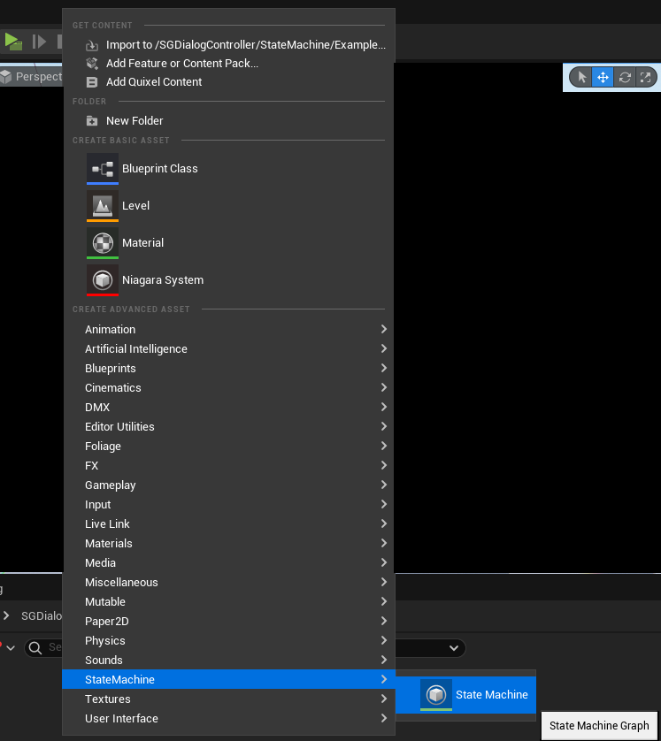

When choosing to create a new type of asset *State Machine*, a new asset will appear. A new modal window *Pick State Machine class* opens, where we must select a class for the future state machine. By default, there is only one such class and it is **StateMachinGraph**.

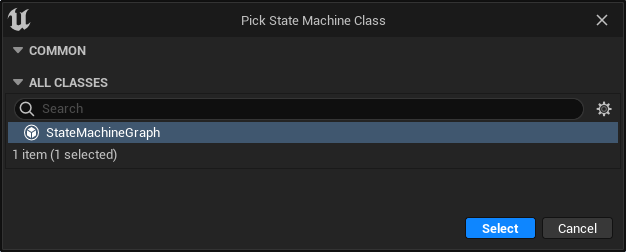

I prefer to name this type of asset with the prefix **"CSM_..."** (*Custom State Machine*).

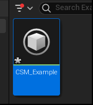

Double clicking on an asset opens the GraphEditor window. The main graph properties are listed in the Details tab.

> Attention: We will return to a detailed description of GraphEditor and its properties later.

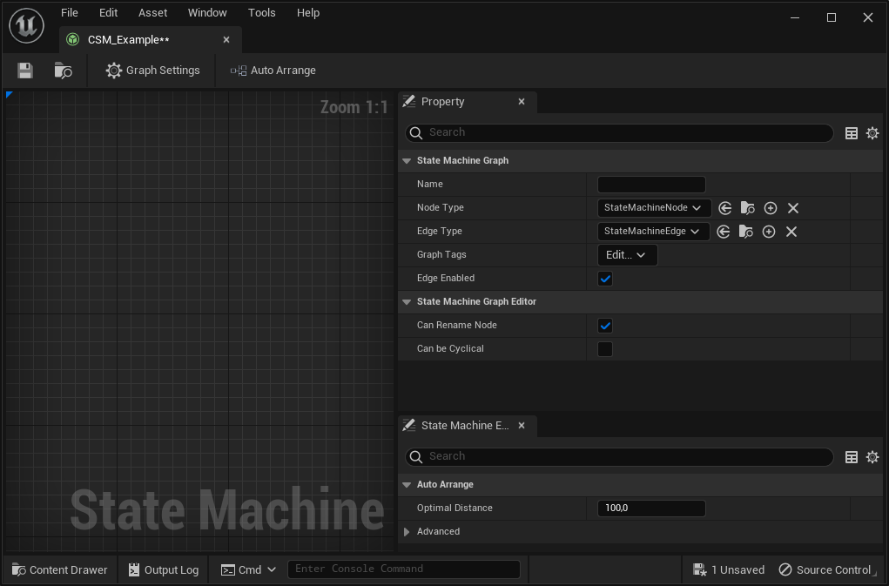

### Traffic light example

To understand the abstract essence of the **State Machine**, it is worth considering it with some example. The plugin implements an example with a ***traffic light state machine***. This is a simple enough state machine to get familiar with the plugin.

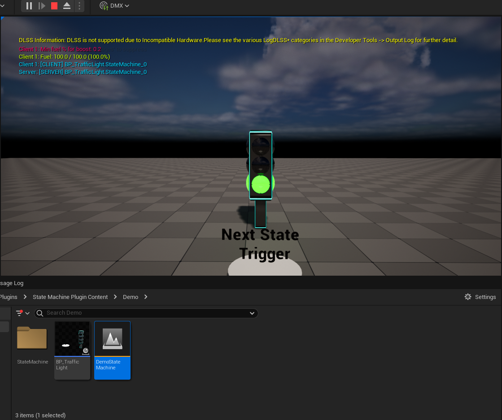

Logically, it seems to me, it is easy to understand that a traffic light has three main (simplified) states - green, yellow and red. And if the boundary states (green and red) are simple, since they have one input (from yellow) and one output (to yellow), then the yellow state itself is more complicated, since it has two inputs (from green and red) and two outputs (in green and in red).

In order to create a state in the editor, we need to right-click and select the **Blueprint Class** menu item. In the window that opens, expand the **All classes** list, find and select the **State** class there and click the **Select** button.

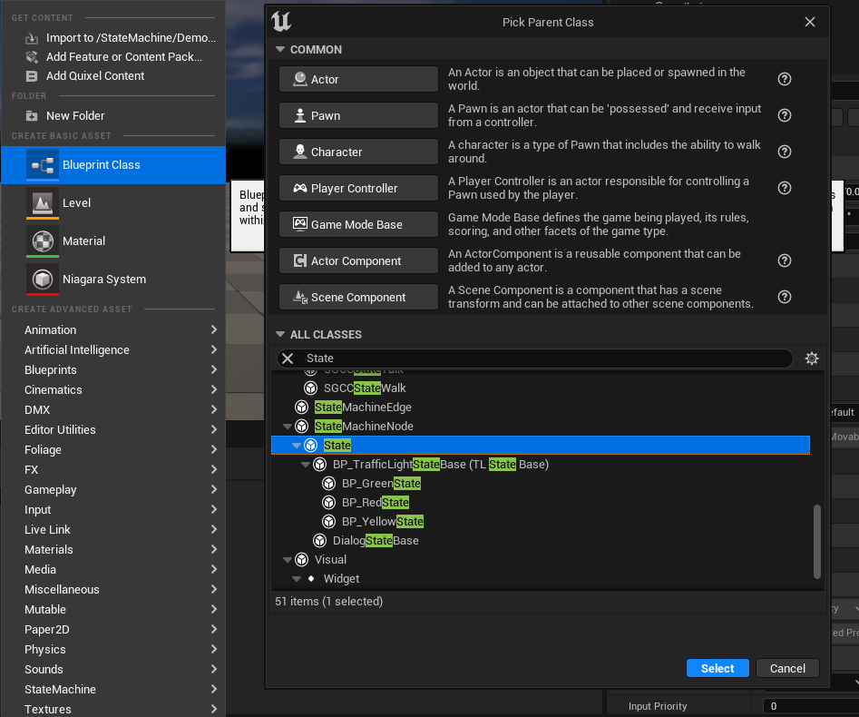

The state itself is edited in a standard blueprint editor. In the details panel, consider the main properties of the state:
* **ID** - a unique identifier that is created when a state is created. Has a text type and can be set manually for readability
* **Node Title** - the title of the state (node) that will be displayed as text on the som graph (Graph Editor)
* **Background Color** - node color in GraphEditor
* **Context Menu Name** - the name that will be displayed in the context menu for adding a state to GraphEditor.

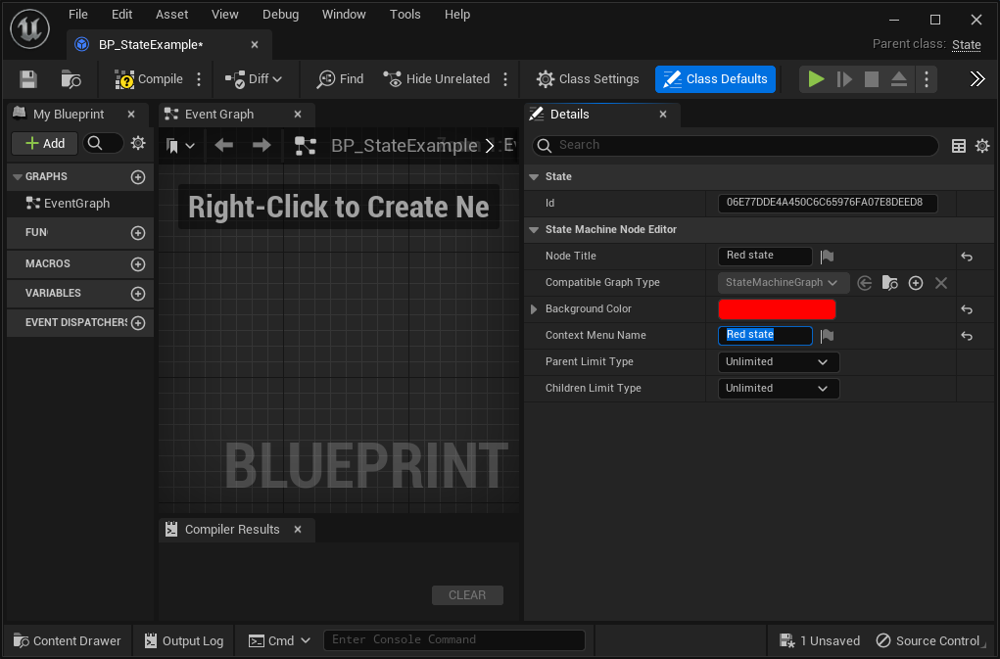

To implement the main logic and reaction to the outside world, as well as to set the logic for switching states, the base class has a set of functions that can (and should) be overridden in the blueprint:
* `Enter` & `Leave` - Functions that are called when the state is entered and exited
* `BindDynamics` & `UnbindDynamics` - helper functions that can also be called when entering and exiting the state, but are intended for subscribing and unsubscribing to/from external world events.

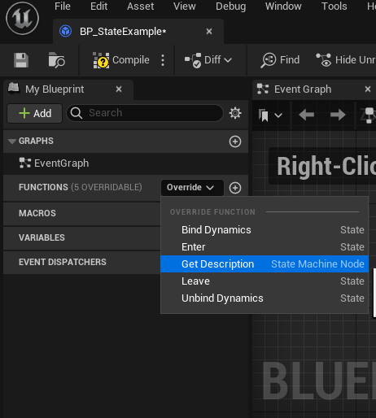

An example of a blueprint implementation for a red and green state is almost identical and is shown in the picture:

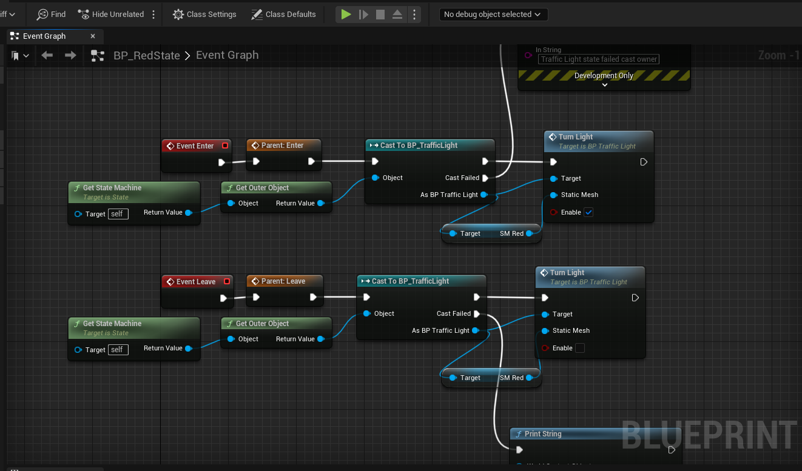

The state for the yellow color in its blueprint implementation is very similar to the implementation of Green and Red, with the exception that a flag variable (bool) has been added to the yellow State itself, which will set the direction for switching. If `IsUp == true`, then from the yellow state it should switch to red, otherwise to green. Each time we exit the state, we will change this flag to the opposite one.

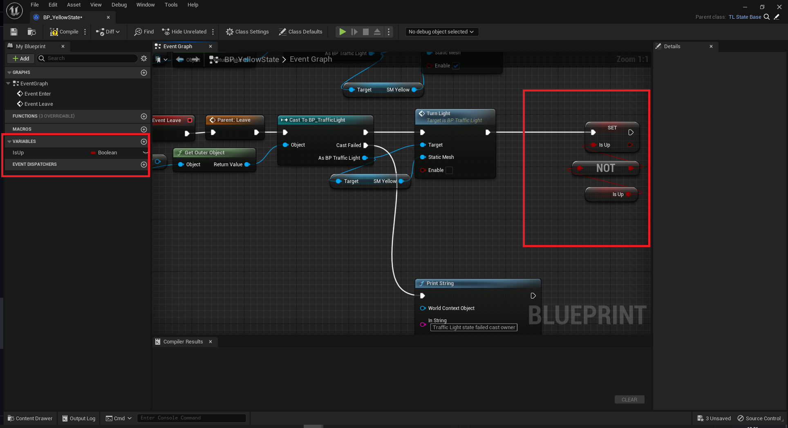

Now we have all the states, the data for the transition from one state to another is given, but the transition conditions themselves have not yet been determined. Transition conditions can be described and implemented in a separate blueprint with the **Transition** entity. For example, let's create two such transients to set the conditions for the transition **from-yellow-to-red** and **from-yellow-to-green**.

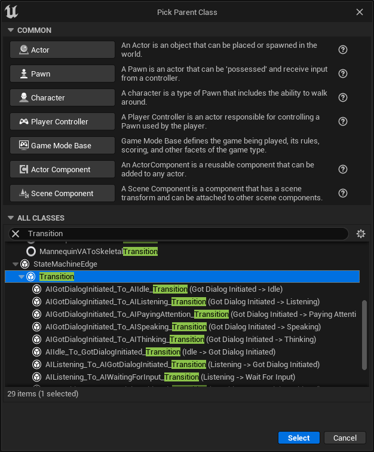

An example of the implementation of transitions can be seen in the image:

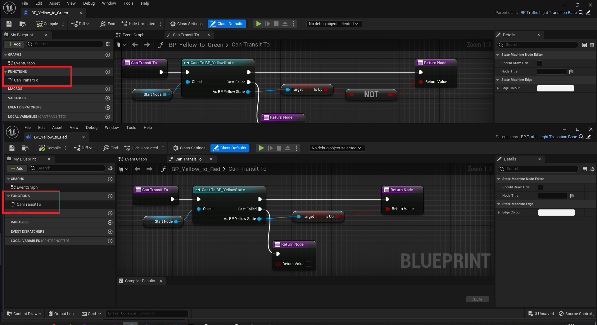

Now we have everything we need to implement the traffic light state machine. Let's create an asset for the state machine and populate it with the states and transitions we just created. If you open the Editor graph and right-click, the context menu for selecting a state class will open. Having selected a class, a node corresponding to this class will appear on the GraphEditor grid, which will designate a specific state.

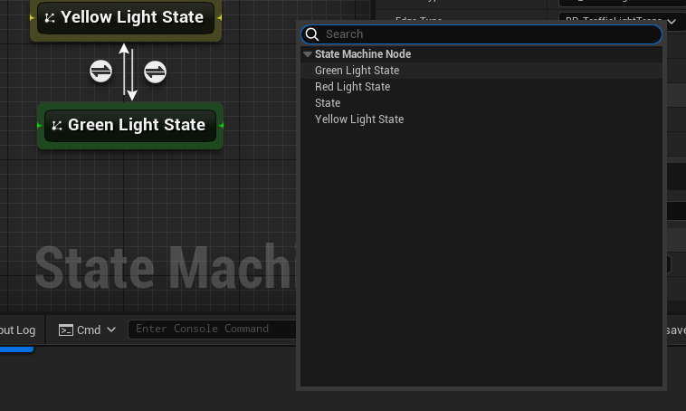

Transitions are created by drag and drop from the edge of a node to another node.
The final graph looks like this:

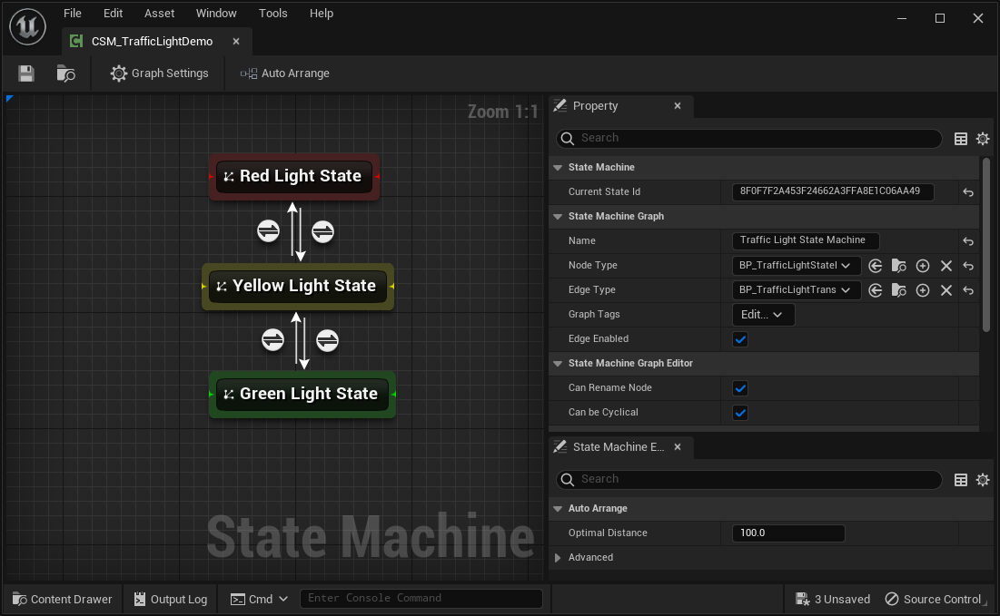

## Logical Description

// TODO:

## Technical description

// TODO:

## Expected Improvements

// TODO: